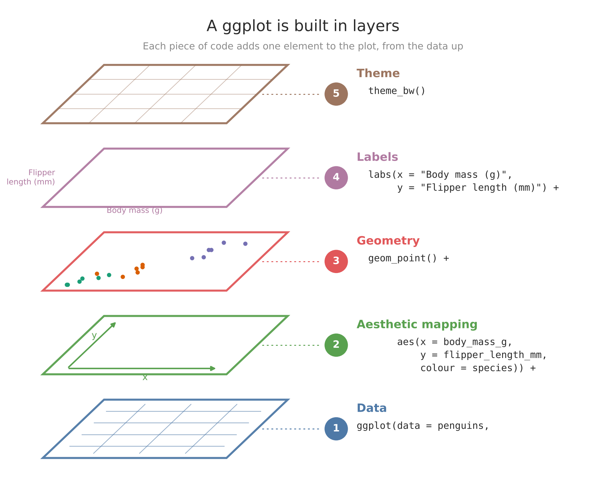
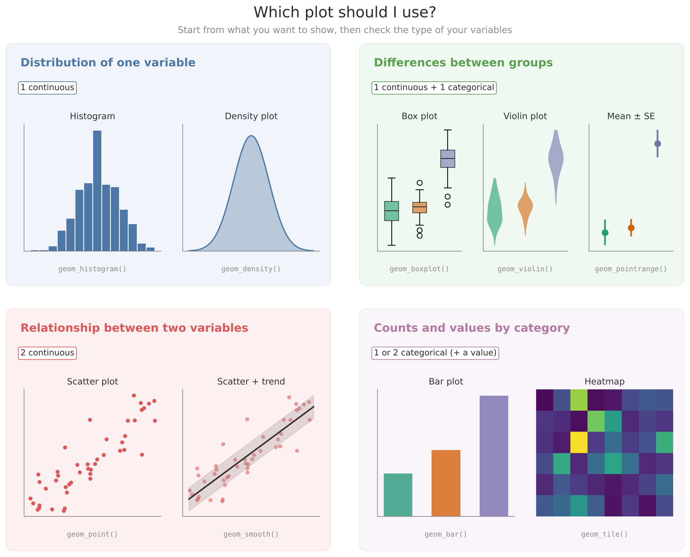

```{r setup, include = FALSE}
knitr::opts_chunk$set(echo = TRUE, comment = "#>", collapse = TRUE,
                      message = FALSE, warning = FALSE,
                      fig.align = "center", out.width = "70%",
                      fig.pos = "H")   # PDF: keep figures where they are written
```

```{r logos, echo = FALSE, eval = knitr::is_html_output(), out.width = c("30%", "30%"), fig.show = "hold", fig.align = "center"}
# HTML only: in the PDF the logos come from preamble.tex
knitr::include_graphics(c("../assets/logos/globe_logo.png",
                          "../assets/logos/urjc_logo.png"))
```

```{r course-name, echo = FALSE, results = "asis", eval = knitr::is_html_output()}
cat("**Erasmus Mundus Master GLOBE: Global Change Ecology and Biodiversity Management**  \n",
    "*Introduction to R for data science and statistical data analysis*\n\n",
    "---\n", sep = "")
```

# Introduction

In this session we learn how to make figures with **ggplot2**: the logic behind its syntax, the most common types of plots for exploring data, and how to choose the right one for your data.

`ggplot2` is not the only way to make plots in R. For a quick look at your data, base R functions such as `plot()` or `hist()` are often enough. For more complex figures, and for figures you want to publish, `ggplot2` is usually the better choice. Which one you use is partly a personal decision, but `ggplot2` has one big advantage: once you understand its logic, the code is very intuitive.

`ggplot2` is part of the **tidyverse**, so you can install it on its own or by installing the whole tidyverse.

Useful resources:

- Package website: <https://ggplot2.tidyverse.org/>
- Free online book: Wickham, H., Navarro, D. & Pedersen, T. L. *ggplot2: Elegant Graphics for Data Analysis* (3rd ed.). <https://ggplot2-book.org/>
- The R Graph Gallery, a great source of code and inspiration: <https://r-graph-gallery.com/>

# Before we start: create an RStudio project

From now on, start every new piece of work by creating an **RStudio project**. A project is a folder that keeps together everything related to one piece of work: data, scripts and figures. When you open it, RStudio sets the working directory to that folder automatically, so you can use relative paths such as `"data/my_data.csv"` and your code will work on any computer.

**1. Create the project.** In RStudio, go to *File → New Project → New Directory → New Project*. Give it a name without spaces or accents, for example `globe_ggplot2`, choose where to save it and click *Create Project*. RStudio restarts inside the new project. You can see its name in the top-right corner.

**2. Create the folder structure.** A simple structure that works for most projects:

- `data/`: the raw data. Never modify these files by hand.
- `scripts/`: your R scripts.
- `figures/`: the figures you save.

You can create the folders from the *Files* pane (*New Folder*) or with code. Here are two ways to do it with code. Run either of them in the console.

**Option 1: the simple way.** One `dir.create()` for each folder:

```{r, eval = FALSE}
dir.create("data")
dir.create("scripts")
dir.create("figures")

list.files()   # check that the three folders are there
```

If a folder already exists, `dir.create()` does not overwrite it: it only gives a warning saying that it already exists.

**Option 2: with a `for` loop.** The loop goes through the folder names one by one, checks whether each folder exists, and creates it only if it doesn't:

```{r, eval = FALSE}
folders <- c("data", "scripts", "figures")

for (folder in folders) {
  if (!dir.exists(folder)) {
    dir.create(folder)
  }
}

list.files()
```

Both give the same result. The second option is longer, but it is easier to reuse: to add a new folder you only need to add its name to `folders`, and it never gives warnings if you run it twice.

**3. Create a script for this session.** Go to *File → New File → R Script* and save it in the `scripts/` folder, for example as `ggplot2_session1.R`. Write the code of this tutorial there, with comments, instead of typing it in the console.

**4. Next time, open the project, not the script.** Double-click the `.Rproj` file in the project folder, or use *File → Open Project*. Everything will be where you left it.

# Packages and data

We need two packages. Install them once, if you don't have them yet:

```{r, eval = FALSE}
install.packages("ggplot2")
install.packages("palmerpenguins")
```

And load them in every session:

```{r}
library(ggplot2)
library(palmerpenguins)
```

Later in the tutorial we will also use `dplyr`, `tidyr`, `vegan`, `ggforce` and `ggridges`. We load them when we need them.

The **palmerpenguins** package contains data on 344 penguins of three species (Adélie, Chinstrap and Gentoo) from three islands in the Palmer Archipelago, Antarctica. The data were collected between 2007 and 2009 by Dr. Kristen Gorman and the Palmer Station Long Term Ecological Research Program, part of the US LTER Network.

```{r}
str(penguins)
```

Some penguins have missing values (`NA`). When a plot leaves them out, `ggplot2` tells you with a warning such as *"Removed 2 rows containing missing values"*. This is not an error: it is just letting you know. In this tutorial we hide these warnings to keep the output clean.

> **Note:** since version 4.5, R also includes a `penguins` dataset in base R, with shorter column names. In this course we always load `palmerpenguins` first, so `penguins` refers to the version in that package.

# The grammar of graphics: plots are built in layers

The "gg" in `ggplot2` stands for **grammar of graphics**. Writing a `ggplot2` figure is like building a sentence: each part adds something to the previous one. Each **layer of code** adds a **graphical element** to the plot.

The main function is `ggplot()`. It needs two things:

1. **The data**: the data frame you want to plot.
2. **The aesthetic mapping, `aes()`**: which variables of your data go to which part of the plot (x axis, y axis, colour, size...).

Then we add layers with `+`.

```{r layers-figure, echo = FALSE, out.width = "85%", fig.cap = "A ggplot is built in layers, from the data up. Each layer of code adds one element to the plot."}

```

Let's build the same plot step by step and look at what each layer adds.

**Step 1.** `ggplot()` with only the data creates an empty canvas:

```{r}
ggplot(penguins)
```

**Step 2.** `aes()` tells `ggplot2` which variables go on each axis. Now the axes appear, but there is still nothing drawn on them:

```{r}
ggplot(penguins, aes(x = body_mass_g, y = flipper_length_mm))
```

**Step 3.** A `geom_*()` layer decides **how** the data are drawn. `geom_point()` draws points:

```{r}
ggplot(penguins, aes(x = body_mass_g, y = flipper_length_mm)) +
  geom_point()
```

**Step 4.** `labs()` changes the titles of the axes:

```{r}
ggplot(penguins, aes(x = body_mass_g, y = flipper_length_mm)) +
  geom_point() +
  labs(x = "Body mass (g)", y = "Flipper length (mm)")
```

**Step 5.** A `theme_*()` layer changes the general appearance:

```{r}
ggplot(penguins, aes(x = body_mass_g, y = flipper_length_mm)) +
  geom_point() +
  labs(x = "Body mass (g)", y = "Flipper length (mm)") +
  theme_classic()
```

In summary, the order is:

1. Create the canvas with `ggplot()` and the **data**.
2. Map variables to the plot with `aes()`.
3. Add one or more `geom_*()` layers (`geom_point()`, `geom_histogram()`, `geom_boxplot()`...).
4. Add labels, scales, themes and any other details.

A plot can also be stored as an **object**, and you can keep adding layers to it later:

```{r}
p <- ggplot(penguins, aes(x = body_mass_g, y = flipper_length_mm))

p + geom_point()
```

As always in R, if you don't assign it with `<-`, the plot is only shown, not saved.

# Choosing the right plot

Before making a plot, ask yourself two questions:

1. **What do I want to show?** The distribution of a variable, differences between groups, a relationship between two variables, or counts and values by category.
2. **What type of variables do I have?** Continuous or categorical.

The answers point you to the right type of plot:

```{r which-plot-figure, echo = FALSE, out.width = "95%", fig.cap = "Which plot should I use? Start from what you want to show, then check the type of your variables."}

```

There are many more types of plots, but these cover most of the exploration you will do in this course. We will go through all of them in this session.

# Scatter plots

A scatter plot shows the **relationship between two continuous variables**. We use `geom_point()`.

```{r}
ggplot(penguins, aes(x = body_mass_g, y = flipper_length_mm)) +
  geom_point()
```

Inside `aes()` we can map other variables to the **colour** (`colour`), **shape** (`shape`) or **size** (`size`) of the points.

Colour by species:

```{r}
ggplot(penguins, aes(x = body_mass_g, y = flipper_length_mm, colour = species)) +
  geom_point()
```

Colour and shape by species:

```{r}
ggplot(penguins, aes(x = body_mass_g, y = flipper_length_mm,
                     colour = species, shape = species)) +
  geom_point()
```

Size depending on a third continuous variable:

```{r}
ggplot(penguins, aes(x = body_mass_g, y = flipper_length_mm,
                     colour = species, size = bill_length_mm)) +
  geom_point(alpha = 0.6)
```

`alpha` controls transparency (from 0, invisible, to 1, opaque). It helps when points overlap.

## Adding a trend line

`geom_smooth()` adds a line that summarises the relationship. With `method = "lm"` it draws a straight line from a **linear model**, with its confidence interval as a grey band:

```{r}
ggplot(penguins, aes(x = body_mass_g, y = flipper_length_mm)) +
  geom_point(alpha = 0.5) +
  geom_smooth(method = "lm")
```

Because `colour = species` is set in `ggplot()`, it applies to **all** layers, so we get one line per species:

```{r}
ggplot(penguins, aes(x = body_mass_g, y = flipper_length_mm, colour = species)) +
  geom_point(alpha = 0.5) +
  geom_smooth(method = "lm")
```

If instead you write `geom_point(aes(colour = species))`, the mapping applies only to that layer: the points are coloured but there is a single line for all the data. Where you put each aesthetic matters.

For now we use these lines only to **explore** the data. What a linear model is, and how to fit and interpret it, is the subject of Section III.

## Inside or outside `aes()`? {#inside-or-outside-aes}

This is one of the most common mistakes with `ggplot2`:

- **Inside `aes()`** you **map a variable**: the colour changes with the data, and a legend appears.
- **Outside `aes()`**, inside the `geom`, you **set a fixed value**: all points get the same colour.

```{r}
# Right: all points blue
ggplot(penguins, aes(x = body_mass_g, y = flipper_length_mm)) +
  geom_point(colour = "blue")
```

```{r}
# Wrong: "blue" is treated as a variable with a single value
ggplot(penguins, aes(x = body_mass_g, y = flipper_length_mm, colour = "blue")) +
  geom_point()
```

In the second plot the points are not blue, and there is a strange legend called "blue". `ggplot2` has created a variable with the value `"blue"` and has given it the first default colour.

> **Rule:** variables go inside `aes()`; fixed values go outside.

# Histograms

A histogram shows the **distribution of one continuous variable**. It only needs one variable, mapped to `x`. We use `geom_histogram()`.

```{r}
ggplot(penguins, aes(x = body_mass_g)) +
  geom_histogram()
```

By default `ggplot2` groups the data into 30 bins. The shape of a histogram depends a lot on the **width of the bins**, which we change with `binwidth` (in the units of the variable, here grams). We can also change the colour of the bars with `fill` (inside) and `colour` (border):

```{r}
ggplot(penguins, aes(x = body_mass_g)) +
  geom_histogram(binwidth = 200, fill = "white", colour = "black")
```

`boundary` sets where the bins start. Compare these two histograms: same data, same `binwidth`, different `boundary`.

```{r}
ggplot(penguins, aes(x = body_mass_g)) +
  geom_histogram(binwidth = 200, fill = "white", colour = "black", boundary = 0)

ggplot(penguins, aes(x = body_mass_g)) +
  geom_histogram(binwidth = 200, fill = "white", colour = "black", boundary = 100)
```

Always explore your data with several bin widths before drawing conclusions about the shape of a distribution. Try it yourself with `binwidth = 50` and `binwidth = 500`.

## Histograms by group

The histogram above shows the distribution of body mass for all penguins together. But how is body mass distributed **within each species**? There are two ways to show this.

**Option 1: one panel per group, with facets.** `facet_grid()` splits the plot into several panels, one for each value of a categorical variable. The formula `species ~ .` means "one row per species".

```{r}
ggplot(penguins, aes(x = body_mass_g)) +
  geom_histogram(binwidth = 200, fill = "white", colour = "black") +
  facet_grid(species ~ .)
```

`ggplot2` does the grouping itself: you don't need to group the data before plotting.

With `scales = "free_y"`, each panel gets its own y axis. This is useful when groups have very different sizes, but be careful: it makes the panels harder to compare.

```{r}
ggplot(penguins, aes(x = body_mass_g)) +
  geom_histogram(binwidth = 200, fill = "white", colour = "black") +
  facet_grid(species ~ ., scales = "free_y")
```

**Option 2: all groups in one plot, with colours.** We map the grouping variable to `fill`. The grouping variable must be a factor or character.

```{r}
ggplot(penguins, aes(x = body_mass_g, fill = species)) +
  geom_histogram(binwidth = 200, position = "identity", alpha = 0.5)
```

Two arguments are essential here:

- `position = "identity"` draws each histogram from zero. Without it, the bars are **stacked** on top of each other, and the plot is misleading.
- `alpha` makes the bars transparent, so you can see where they overlap.

> **Rule:** for grouped data, your data frame needs one column with the groups (categorical) and one column with the values (continuous). This is the *long format* we will see in the dplyr session.

# Density plots

A density plot is a **smoothed version of a histogram**. Instead of bars, it draws a curve that shows the shape of the distribution: whether there is one peak or several, or whether it is skewed to one side. We use `geom_density()`.

```{r}
ggplot(penguins, aes(x = body_mass_g)) +
  geom_density()
```

How smooth the curve is depends on the **bandwidth**, which we change with `adjust`. Values below 1 give a more wiggly curve; values above 1 give a smoother one:

```{r}
ggplot(penguins, aes(x = body_mass_g)) +
  geom_density(adjust = 0.25, colour = "red") +
  geom_density(adjust = 2, colour = "blue")
```

`fill` colours the area under the curve, and `alpha` makes it transparent:

```{r}
ggplot(penguins, aes(x = body_mass_g)) +
  geom_density(fill = "steelblue", alpha = 0.3)
```

And, as with histograms, we can compare groups:

```{r}
ggplot(penguins, aes(x = body_mass_g, fill = species)) +
  geom_density(alpha = 0.4)
```

## Histogram and density curve together

To overlay a density curve on a histogram, both must be on the **same scale**. A histogram counts observations, while a density curve shows proportions, so we ask the histogram to use densities with `y = after_stat(density)`:

```{r}
ggplot(penguins, aes(x = body_mass_g)) +
  geom_histogram(aes(y = after_stat(density)),
                 binwidth = 200, fill = "grey90", colour = "grey60") +
  geom_density(linewidth = 1) +
  geom_vline(xintercept = mean(penguins$body_mass_g, na.rm = TRUE),
             linetype = "dashed", linewidth = 1)
```

`geom_vline()` adds a vertical line, here at the mean body mass. `geom_hline()` adds a horizontal line. `linewidth` controls the thickness of lines.

> **Note:** in older code you will often see `..density..` instead of `after_stat(density)`, and `size` instead of `linewidth` for lines. Both still work, but they are outdated and give warnings in recent versions of `ggplot2`.

# Box plots

A box plot shows the **distribution of a continuous variable** and makes it easy to **compare groups**. The continuous variable goes on the y axis and the groups on the x axis. Before making one, let's remember what each part of a box plot means:

```{r boxplot-anatomy, echo = FALSE, out.width = "60%", fig.cap = "Parts of a box plot (simulated data)."}
set.seed(42)
y_sim <- c(rnorm(60, mean = 20, sd = 3), 32)
q <- quantile(y_sim, c(0.25, 0.5, 0.75))
iqr <- q[3] - q[1]
upper <- max(y_sim[y_sim <= q[3] + 1.5 * iqr])
lower <- min(y_sim[y_sim >= q[1] - 1.5 * iqr])
outl  <- y_sim[y_sim > q[3] + 1.5 * iqr | y_sim < q[1] - 1.5 * iqr]

labels_df <- data.frame(
  y = c(max(outl), upper, q[3], q[2], q[1], lower),
  label = c("Outlier: beyond 1.5 × IQR",
            "Upper whisker: largest value within Q3 + 1.5 × IQR",
            "Q3: 75% of the data are below",
            "Median: 50% of the data are below",
            "Q1: 25% of the data are below",
            "Lower whisker: smallest value within Q1 − 1.5 × IQR")
)

ggplot(data.frame(group = "", y = y_sim), aes(x = group, y = y)) +
  geom_boxplot(width = 0.3) +
  annotate("segment", x = 1.38, xend = 1.18,
           y = labels_df$y, yend = labels_df$y,
           arrow = arrow(length = unit(0.15, "cm")), colour = "grey40") +
  annotate("text", x = 1.4, y = labels_df$y, label = labels_df$label,
           hjust = 0, size = 3.2) +
  annotate("text", x = 0.75, y = mean(q[c(1, 3)]),
           label = "IQR\n(Q3 − Q1)", size = 3.2, colour = "grey30") +
  scale_x_discrete(expand = expansion(add = c(0.5, 2.2))) +
  labs(x = NULL, y = NULL) +
  theme_classic() +
  theme(axis.line.x = element_blank(), axis.ticks.x = element_blank())
```

The IQR (*interquartile range*) is the height of the box: the range that contains the central 50% of the data.

## Basic box plot

```{r}
ggplot(penguins, aes(x = species, y = body_mass_g)) +
  geom_boxplot()
```

We can change the size and shape of the outliers with `outlier.size` and `outlier.shape`, and the width of the boxes with `width`:

```{r}
ggplot(penguins, aes(x = species, y = body_mass_g)) +
  geom_boxplot(outlier.size = 1.5, outlier.shape = 21, width = 0.4)
```

## Adding information to a box plot

`notch = TRUE` narrows the box around the median. If the notches of two boxes do not overlap, that is a rough sign that their medians differ.

`stat_summary()` adds a summary statistic to the plot. Here we add the **mean** as a white diamond, so we can compare it with the median:

```{r}
ggplot(penguins, aes(x = species, y = body_mass_g)) +
  geom_boxplot(notch = TRUE, outlier.shape = 21, width = 0.4) +
  stat_summary(fun = "mean", geom = "point", shape = 23, size = 3, fill = "white")
```

## Colours and labels

ColorBrewer palettes are sets of colours designed to look good together and to be readable. They are included in `ggplot2`, so we only need `scale_colour_brewer()` (for `colour`) or `scale_fill_brewer()` (for `fill`). We also use `labs()` to rename the axes. `guide = "none"` removes the legend, which here is redundant because the species are already on the x axis.

```{r}
ggplot(penguins, aes(x = species, y = body_mass_g, colour = species)) +
  geom_boxplot(notch = TRUE, outlier.shape = 21, width = 0.4) +
  stat_summary(fun = "mean", geom = "point", shape = 23, size = 3, fill = "white") +
  labs(x = "Species", y = "Body mass (g)") +
  scale_colour_brewer(palette = "Dark2", guide = "none")
```

`colour` changes the border of the boxes; `fill` changes the inside. Try changing `colour = species` to `fill = species` and `scale_colour_brewer()` to `scale_fill_brewer()`.

## Box plot with the raw data

A box plot summarises the data, but hides how many observations there are and how they are spread. We can add the raw data with `geom_jitter()`, which draws points with a small random horizontal shift so that they don't overlap.

```{r}
bp <- ggplot(penguins, aes(x = species, y = body_mass_g, colour = species)) +
  geom_boxplot(outlier.shape = NA, width = 0.4) +
  labs(x = "Species", y = "Body mass (g)") +
  scale_colour_brewer(palette = "Dark2", guide = "none")

bp + geom_jitter(width = 0.2, alpha = 0.5)
```

We use `outlier.shape = NA` to hide the outliers of the box plot, because they are already drawn by `geom_jitter()`. Otherwise they would appear twice.

Adding the raw data gives more information, but also more visual noise. Decide in each case whether it helps.

## Changing the appearance with themes

`theme_*()` functions change the general appearance of a plot. `theme_set()` sets a theme for **all the plots that follow**, so you don't have to add it every time:

```{r}
theme_set(theme_bw())

bp + geom_jitter(width = 0.2, alpha = 0.5)
```

From now on, all plots in this tutorial use `theme_bw()`. We will see themes in more detail in the next session.

# Violin plots

Violin plots are an alternative to box plots. Like them, they show the distribution of a continuous variable in each group. The difference is that they use a **density curve** (like a density plot, but mirrored) to show where most of the values are concentrated. We use `geom_violin()`.

To avoid repeating code, we first store a base plot, `g`, and add different layers to it:

```{r}
g <- ggplot(penguins, aes(x = species, y = body_mass_g, colour = species)) +
  labs(x = "Species", y = "Body mass (g)") +
  scale_colour_brewer(palette = "Dark2", guide = "none")

g + geom_violin(fill = "grey80", linewidth = 1, alpha = 0.5)
```

## Violin plot with the raw data

We can add the points with `geom_jitter()`. Here we also use `coord_flip()`, which swaps the x and y axes so that the violins are horizontal:

```{r}
g +
  geom_violin(fill = "grey80", linewidth = 1, alpha = 0.5) +
  geom_jitter(width = 0.15, alpha = 0.2) +
  coord_flip()
```

The **ggforce** package provides `geom_sina()`. Instead of a fixed random width, it spreads the points according to the density of the data, so the points follow the shape of the violin:

```{r, eval = FALSE}
install.packages("ggforce")   # only once
```

```{r}
library(ggforce)

g +
  geom_violin(fill = "grey80", linewidth = 1, alpha = 0.5) +
  geom_sina(alpha = 0.2) +
  coord_flip()
```

## Violin plot with a box plot inside

Combining both gives the shape of the distribution (violin) and its main statistics (box plot) in the same figure. Note that the violins use `fill`, so we need `scale_fill_brewer()` here, not `scale_colour_brewer()`:

```{r}
g +
  geom_violin(aes(fill = species), linewidth = 1, alpha = 0.4) +
  geom_boxplot(width = 0.15, fill = "white", colour = "grey20",
               outlier.size = 1.5) +
  scale_fill_brewer(palette = "Dark2", guide = "none") +
  coord_flip()
```

The box plot inside is narrow (`width = 0.15`) and white, so it stands out against the violin without hiding it. It keeps all its parts: box, median, whiskers and outliers.

# Ridgeline plots

When you want to compare the distribution of a variable between **many groups**, overlapping density curves become unreadable, and box plots hide the shape of each distribution. **Ridgeline plots** solve this: they draw one density curve per group, slightly overlapping each other, like a mountain range. We need the **ggridges** package:

```{r, eval = FALSE}
install.packages("ggridges")   # only once
```

```{r}
library(ggridges)
```

The basic function is `geom_density_ridges()`. The continuous variable goes on the x axis and the groups on the y axis:

```{r}
ggplot(penguins, aes(x = body_mass_g, y = species, fill = species)) +
  geom_density_ridges(alpha = 0.7) +
  scale_fill_brewer(palette = "Dark2", guide = "none") +
  labs(x = "Body mass (g)", y = NULL)
```

With only three species, this is not very different from a violin plot. Ridgelines really make sense with many groups. The `ggridges` package includes `lincoln_weather`, the daily weather in Lincoln (Nebraska, USA) during 2016. Let's look at how the daily mean temperature is distributed in each month. Temperatures are in degrees Fahrenheit, so we first convert them to Celsius:

```{r}
library(dplyr)   # for mutate()

weather <- lincoln_weather |>
  mutate(temp_c = (`Mean Temperature [F]` - 32) * 5 / 9)
```

The column name has spaces and brackets, so we must write it between backticks (`` ` ``).

```{r, out.width = "80%"}
ggplot(weather, aes(x = temp_c, y = Month, fill = after_stat(x))) +
  geom_density_ridges_gradient(scale = 3, rel_min_height = 0.01) +
  scale_fill_viridis_c(option = "C", name = "Temperature (°C)") +
  labs(x = "Daily mean temperature (°C)", y = NULL)
```

Some details:

- `geom_density_ridges_gradient()` allows the colour to change **along** each curve. With `fill = after_stat(x)`, each part of the curve is coloured by its value on the x axis: here, its temperature.
- `scale` controls how much the curves overlap: 1 means they just touch; larger values make them overlap more.
- `rel_min_height` cuts the long, flat tails of the curves, which makes the plot cleaner.

In one figure you can see the whole seasonal cycle: the shift from cold to warm months, and how temperatures are much more variable in some months than in others. In ecology, ridgelines are useful, for example, to compare trait distributions among many species, or a variable along a gradient of sites or years.

# Bar plots

Bar plots are useful for two different things, and it is important not to confuse them.

## Counting observations

`geom_bar()` **counts** how many rows there are in each category. It only needs `x`:

```{r}
ggplot(penguins, aes(x = island)) +
  geom_bar()
```

With `fill` we can split each bar by a second categorical variable. `position = "dodge"` puts the bars side by side instead of stacking them:

```{r}
ggplot(penguins, aes(x = island, fill = species)) +
  geom_bar(position = "dodge") +
  scale_fill_brewer(palette = "Dark2") +
  labs(x = "Island", y = "Number of penguins", fill = "Species")
```

This plot shows something we would not see in a table at first sight: Gentoo penguins only live on Biscoe, and Chinstrap penguins only on Dream.

## Showing means and their uncertainty

Many papers show the **mean of each group with error bars**. To do this we first need to calculate the means and their standard errors (SE) with `dplyr`, which we saw in Section I:

```{r}
mass_summary <- penguins |>
  filter(!is.na(body_mass_g)) |>
  group_by(species) |>
  summarise(mean_mass = mean(body_mass_g),
            se_mass   = sd(body_mass_g) / sqrt(n()))

mass_summary
```

Now the values are already calculated, so we use `geom_col()`, which draws bars with the height we give it in `y` (unlike `geom_bar()`, which counts). `geom_errorbar()` adds the error bars:

```{r}
ggplot(mass_summary, aes(x = species, y = mean_mass)) +
  geom_col(fill = "grey70", width = 0.6) +
  geom_errorbar(aes(ymin = mean_mass - se_mass, ymax = mean_mass + se_mass),
                width = 0.15) +
  labs(x = "Species", y = "Body mass (g, mean ± SE)")
```

A bar always starts at zero, and a lot of ink is spent on the part of the bar that carries no information. A **dot plot** with `geom_pointrange()` shows the same information more clearly, and the y axis does not need to start at zero:

```{r}
ggplot(mass_summary, aes(x = species, y = mean_mass, colour = species)) +
  geom_pointrange(aes(ymin = mean_mass - se_mass, ymax = mean_mass + se_mass),
                  size = 0.8, linewidth = 1) +
  scale_colour_brewer(palette = "Dark2", guide = "none") +
  labs(x = "Species", y = "Body mass (g, mean ± SE)")
```

Keep in mind that means and error bars hide how the data are distributed. When you have the raw data, a box plot or a violin plot usually tells you more.

# Heatmaps

A heatmap shows a **value for each combination of two categorical variables** as a grid of coloured cells. In ecology they are very useful to show **community matrices**: the abundance of each species (rows) in each site (columns). We use `geom_tile()`.

We use the `BCI` dataset from the `vegan` package again: tree counts of 225 species in 50 plots of 1 ha on Barro Colorado Island, Panama. To keep the plot readable, we take the 15 most abundant species in the first 10 plots.

`ggplot2` needs the data in **long format**: one row per species and plot, as we saw with `pivot_longer()` in Section I.

```{r, eval = FALSE}
install.packages(c("vegan", "tidyr"))   # only once
```

```{r}
library(vegan)
library(tidyr)
data(BCI)

top_species <- names(sort(colSums(BCI), decreasing = TRUE))[1:15]

bci_long <- BCI[1:10, top_species] |>
  mutate(plot = factor(1:10)) |>
  pivot_longer(cols = -plot, names_to = "species", values_to = "abundance") |>
  mutate(species = gsub(".", " ", species, fixed = TRUE),
         species = factor(species, levels = rev(gsub(".", " ", top_species, fixed = TRUE))))

head(bci_long)
```

Depending on your version of `vegan`, species names may come as `Genus.species`. The two `gsub()` lines replace the dot with a space, so the names look right in the plot.

```{r, out.width = "85%"}
ggplot(bci_long, aes(x = plot, y = species, fill = abundance)) +
  geom_tile(colour = "white") +
  scale_fill_viridis_c() +
  labs(x = "Plot", y = NULL, fill = "Number\nof trees") +
  theme(axis.text.y = element_text(face = "italic"))
```

A few details:

- `colour = "white"` draws a thin border around each cell, which makes the grid easier to read.
- `scale_fill_viridis_c()` uses the *viridis* palette for continuous values (`_c`). It is readable in black and white and by people with colour blindness.
- We ordered the species from most to least abundant with `factor(..., levels = ...)`. Without it, they would appear in alphabetical order.
- `theme(axis.text.y = element_text(face = "italic"))` writes the species names in italics, as they should be.

At a glance you can see which species dominate across all plots and which ones are abundant only in a few of them. This is much harder to see in a table of numbers.

# Saving your plots

To save a plot as an image, use `ggsave()`. By default it saves the last plot shown, but it is safer to store the plot in an object and tell `ggsave()` which one to save.

Remember that `ggsave()` does not create folders: check that the folder exists first.

```{r, eval = FALSE}
if (!dir.exists("figures")) {
  dir.create("figures")
}

ggsave("figures/body_mass_species.png", plot = bp,
       width = 15, height = 10, units = "cm", dpi = 300)
```

The file format is taken from the extension: `.png`, `.jpg`, `.pdf`, `.svg`...

# Common mistakes with ggplot2

**The `+` must go at the end of the line, not at the start.** If a line ends without `+`, R thinks the plot is finished. The next line starts with `+` and has nothing to add to:

```{r, error = TRUE}
ggplot(penguins, aes(x = body_mass_g, y = flipper_length_mm))
  + geom_point()
```

**Use `+` between layers, not the pipe.** `ggplot2` layers are joined with `+`. Using `|>` or `%>%` between layers gives an error.

**Variables inside `aes()`, fixed values outside.** See [Inside or outside `aes()`?](#inside-or-outside-aes).

**`colour` and `fill` are different.** For points and lines, use `colour`. For shapes with an area (bars, boxes, violins, densities), `fill` is the inside and `colour` is the border. The same applies to the scales: `scale_colour_*()` and `scale_fill_*()`.

**Histograms by group need `position = "identity"`.** Otherwise the bars are stacked and the distributions look different from what they are.

# License and citation

This material is licensed under a [Creative Commons Attribution 4.0 International License (CC BY 4.0)](https://creativecommons.org/licenses/by/4.0/). You are free to share and adapt it, provided you give appropriate credit.

Please cite as:

> Chacón Labella, J. (`r format(Sys.Date(), '%Y')`). *Introduction to ggplot2*. Introduction to R for data science and statistical data analysis, Section II. Erasmus Mundus Master GLOBE, Universidad Rey Juan Carlos. https://github.com/juliachacon/globe-r-stats

Data: Horst, A. M., Hill, A. P. & Gorman, K. B. (2020). *palmerpenguins: Palmer Archipelago (Antarctica) penguin data*. R package. <https://doi.org/10.5281/zenodo.3960218>
