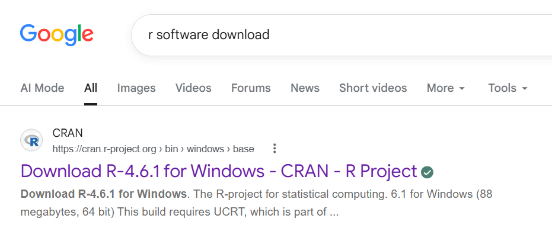
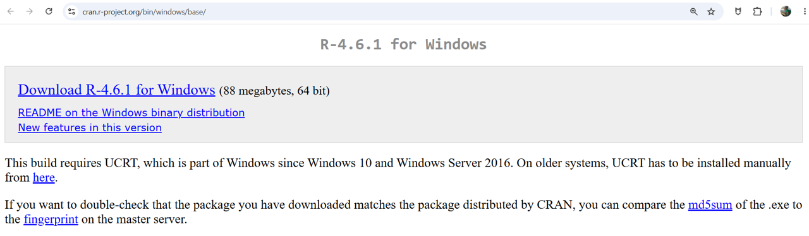
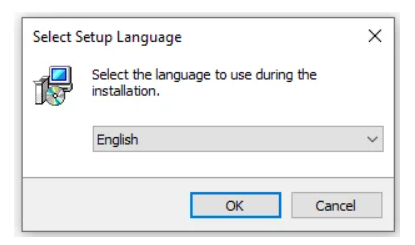
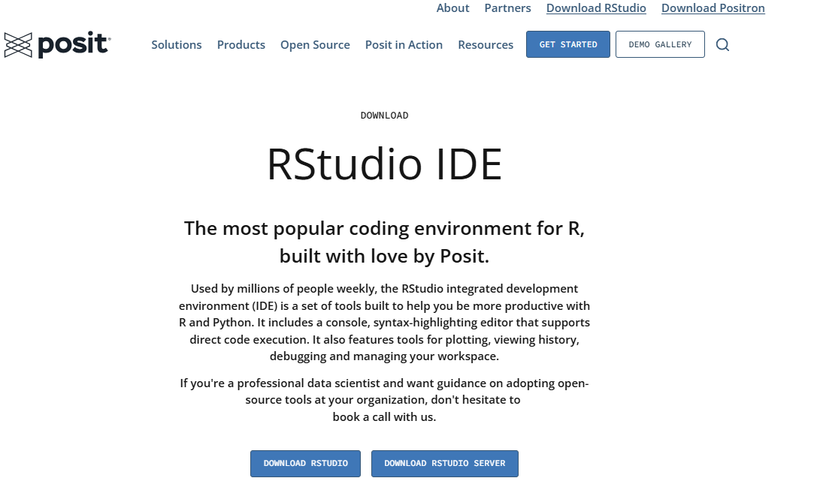
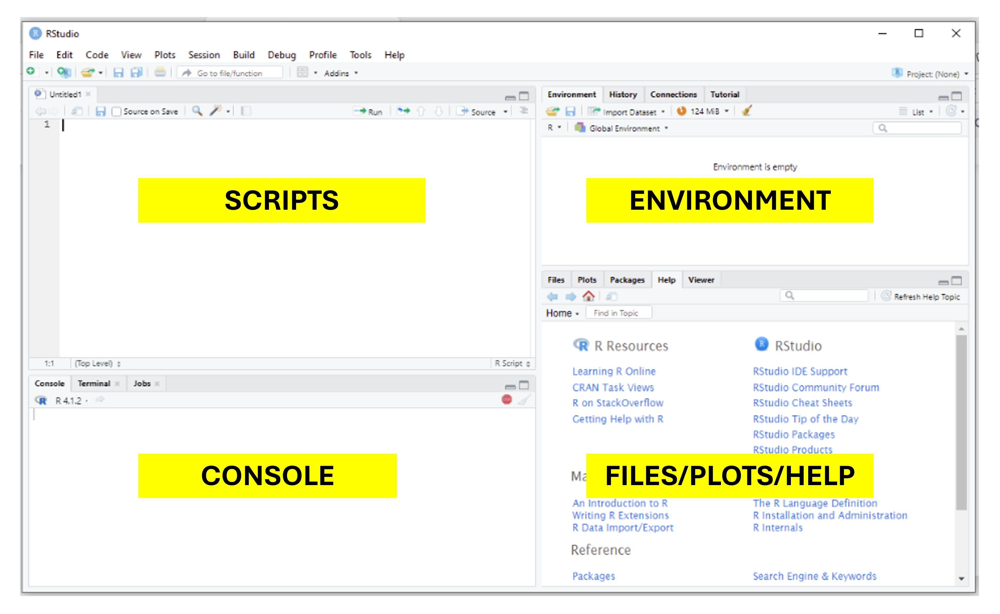
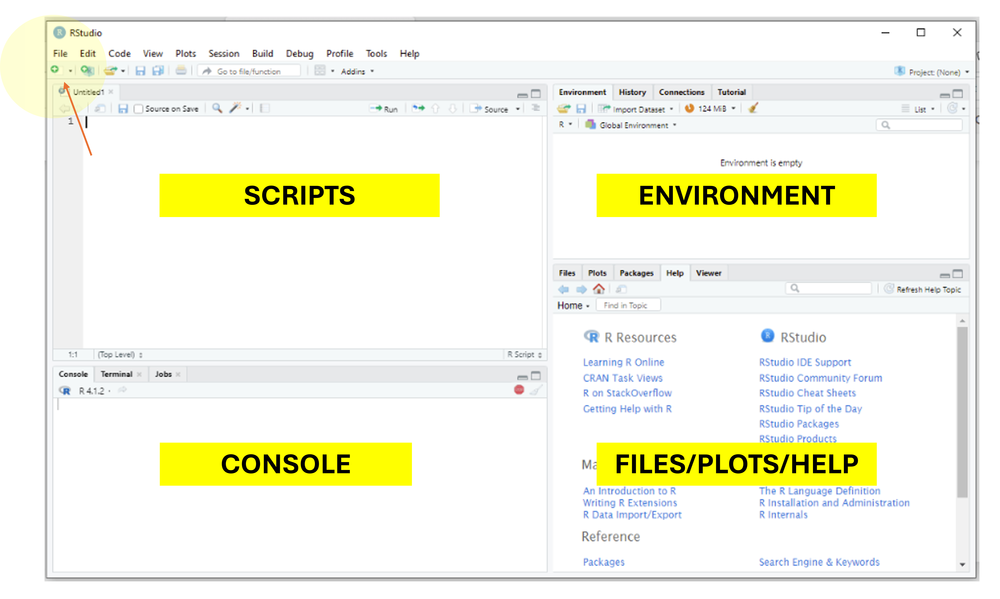
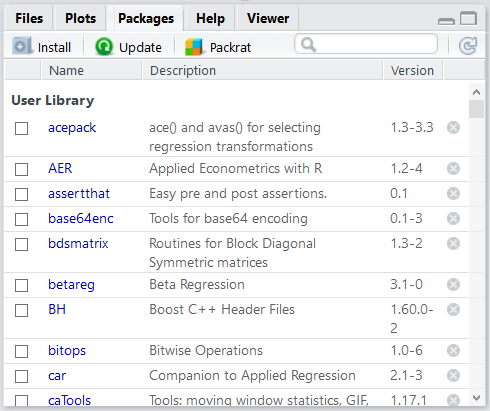

<style>
p.caption {
  font-size: 0.8em;
}

/* Header with logos (replaces the default title block in HTML) */
h1.title, h4.author, h4.date { display: none; }
.course-header { margin: 10px 0 30px; padding-bottom: 12px; border-bottom: 1px solid #ddd; }
.course-header .logos { display: flex; justify-content: space-between; align-items: center; flex-wrap: wrap; gap: 20px; }
.course-header .logos p { margin: 0; }
.course-header img.globe { height: 75px; }
.course-header img.urjc  { height: 55px; }
.course-header .programme { margin-top: 18px; color: #555; }
.course-header h1 { margin-top: 8px; }
.course-header .meta { color: #555; }

/* Simple boxes for objectives, notes, key rules and practice */
.objectives, .note, .tip, .practice {
  padding: 10px 15px; margin: 18px 0;
  background-color: #f7f7f7; border: 1px solid #ddd; border-left: 4px solid #999;
}
</style>

```{=html}
<div class="course-header">
<div class="logos">
<div></div>
<div></div>
</div>
<div class="programme">Erasmus Mundus Joint Master in Global Change Ecology and Biodiversity Management</div>
<h1>Section I · General Introduction I: Installing R and first overview</h1>
<div class="meta">Julia Chacón Labella · Universidad Rey Juan Carlos · Academic year 2026/27</div>
<div class="meta" style="font-size: 0.85em; margin-top: 4px;">Course materials: <a href="https://github.com/juliachacon/globe-r-stats">github.com/juliachacon/globe-r-stats</a> · Licensed under <a href="https://creativecommons.org/licenses/by/4.0/">CC BY 4.0</a></div>
</div>
```

```{r setup, include = FALSE}
knitr::opts_chunk$set(
  collapse = TRUE,
  comment  = "#>",
  message  = FALSE,
  warning  = FALSE
)
```

```{=latex}
\newpage
```

::: {.objectives}
**Learning objectives**

By the end of this session you will be able to:

- install R and RStudio on your own computer;
- identify the four panes of RStudio and what each one is used for;
- write, run, comment and save code in an R script;
- install, load and remove packages;
- use R as a calculator and store results as objects;
- look up the documentation of any function.
:::

# Introduction to R

## What is R

`R` is a free, open-source programming language, especially well suited for statistical analysis and for creating graphics. It is based on the S language, originally developed at Bell Laboratories. R is distributed as free software under the terms of the GNU General Public License (GPL).

Over the last two decades, R has become one of the standard tools in ecology and environmental sciences. Thousands of packages, developed by the scientific community, cover everything from basic statistics to community ecology, species distribution modelling and spatial analysis.

The official website of the R project is <https://www.r-project.org>.

## Installing R

Installing `R` is easy, whether you use `Windows`, `Mac` or `Linux`. Go to the Comprehensive R Archive Network (CRAN), <https://cran.r-project.org/>, and follow the download and installation instructions for your operating system.

Below you will find step-by-step instructions for `Windows`. You can also type "download R" into your search engine and click on the first result, which leads to the CRAN download page. If you use `Mac` or `Linux`, choose the corresponding link on the CRAN homepage and follow the equivalent steps.

::: {.tip}
**Always install the most recent version of R.** The version number (4.6.1 at the time of writing) changes regularly, so the version you see may be more recent than the one shown in the figures.
:::

```{r fig-download-r, echo = FALSE, out.width = '60%', fig.cap = "Figure 1. Downloading R from a search engine"}

```

On the page that opens, click on the link "Download R-4.x.x for Windows". An executable file called "R-4.x.x-win.exe" (where 4.x.x is the current version) will be downloaded to your computer.

```{r fig-download-r2, echo = FALSE, out.width = '60%', fig.cap = "Figure 2. CRAN page from which R is downloaded. Click on Download R, highlighted in yellow"}

```

Double-click on the downloaded file to start the installation. The installation is very simple: keep clicking "OK" or "Next" without changing any of the default options. The first thing the installer asks is the language: **select English**, since the course is taught in English.

```{r fig-install-r, echo = FALSE, out.width = '50%', fig.cap = "Figure 3. Select the language"}

```

Follow the remaining prompts by clicking "Next" to accept the default settings, and click "Finish" when the installation is complete.

::: {.note}
**Summary: installing R**

1. Go to the CRAN download page (<https://cran.r-project.org/>) and choose the link for your operating system.
2. Download the base distribution (e.g. "Download R for Windows").
3. Open the downloaded `.exe` (Windows) or `.pkg` (Mac) file to start the setup wizard.
4. When asked to select a setup language, choose **English** and click OK.
5. Accept the default settings by clicking "Next", and click "Finish" when complete.
:::

## Installing RStudio

```{r fig-rstudio-logo, echo = FALSE, out.width = '30%', fig.cap = "Figure 4. RStudio logo"}

```

`RStudio` is an integrated development environment (IDE) that makes programming in `R` easier: it brings together the console, the scripts, the objects you create, the plots and the help pages in a single window. `R` can be used without `RStudio`, but `RStudio` cannot be used without `R`. We recommend `RStudio` because it makes working with `R` much more comfortable, and **the course will be taught using RStudio**.

::: {.tip}
**Install R first, then RStudio.** RStudio needs R to be installed on your computer in order to work.
:::

Go to the Posit downloads page, <https://posit.co/downloads>, select **RStudio Desktop** (free, open-source licence) and click the download link for your operating system. RStudio is available for `Windows`, `Mac` and `Linux`.

```{r fig-download-rstudio, echo = FALSE, out.width = '60%', fig.cap = "Figure 5. Downloading RStudio"}

```

Run the downloaded installer, accept the default options by clicking "Next", and finish the setup.

## Introduction to RStudio

Once `R` and `RStudio` are installed, open RStudio by clicking on its icon. You do not need to open R separately: RStudio starts R automatically.

### The RStudio interface

When RStudio opens, you will see a screen similar to Figure 6, divided into four panes. The colours on your screen may be different (we will learn how to change them later); for now, focus on the four panes.

```{r fig-rstudio-panes, echo = FALSE, out.width = '60%', fig.cap = "Figure 6. The RStudio interface, made up of four panes"}

```

#### Console

The bottom-left pane is the **console**, the core of both `RStudio` and `R`. This is where we type instructions in the `R` language and where R returns the results. Each instruction is called a **command**.

Try writing your first command in the console and press Enter:

```{r console}
7 + 3
```

The console always shows the **prompt** symbol `>`. It means that R is ready to receive a new command.

#### Scripts

The top-left pane is the **script editor**. Here we also write R code, but in a text file that can be saved, so that we can repeat our analyses at any time, correct them or share them with others. These files are called **R scripts** and have the extension `.R`. We will use them throughout the course.

To open a new R script, click on the button with the plus symbol at the top left and select `R Script` (Figure 7). A blank file will open, ready for you to start writing.

```{r fig-rstudio-scripts, echo = FALSE, out.width = '60%', fig.cap = "Figure 7. Where to find R scripts"}

```

Other ways to open a new script:

- press `Ctrl + Shift + N` (on Mac, `Cmd + Shift + N`);
- go to `File > New File > R Script`.

In an R script, each line is a command. To run the line where the cursor is, press `Ctrl + Enter` (on Mac, `Cmd + Enter`). To run several lines at once, select them and press `Ctrl + Enter`. The result appears in the console.

Comments are added with the hash symbol `#`. Anything written after `#` on a line is ignored by R. Comments are essential to explain what your code does, both to others and to your future self.

```{r code-scripts}
7 + 3  # This is a comment: R only runs the code before the # symbol
```

To save a script, press `Ctrl + S` (on Mac, `Cmd + S`) or go to `File > Save`.

::: {.tip}
**Good practice:** write your code in scripts rather than directly in the console, and comment it generously. A well-commented script is a record of your analysis that anyone (including you, months later) can understand and reproduce.
:::

#### Environment and History

The top-right pane contains several tabs, including **Environment** and **History**. The Environment tab shows the **objects** you create during your working session. R stores these objects in memory so that you can use them in later operations.

We will study objects in detail in the next session, but let us look at a first example. Type the following in your console:

```{r environment-session}
thing <- 2 + 3   # store the result of 2 + 3 in an object called "thing"
thing            # typing the name of the object prints its content
```

Check that `thing` now appears in the Environment tab.

To assign a value to an object we use the assignment operator `<-`, following the structure `object_name <- content`. In RStudio you can type it quickly with the shortcut `Alt + -` (on Mac, `Option + -`).

::: {.note}
**Naming objects:** object names cannot start with a number and cannot contain spaces. R is **case-sensitive**, so `thing`, `Thing` and `THING` are three different objects. Choose short, informative names, such as `tree_height` or `n_species`.
:::

The **History** tab keeps a record of all the commands run during the current session. It is useful to recover code you have lost or to review what you have done.

#### Files, Plots, Packages and Help

The bottom-right pane contains several more tabs:

- **Files**: the files in your working directory, i.e. the folder in which you are working.
- **Plots**: the figures you create.
- **Packages**: the packages installed on your computer; those currently loaded are ticked.
- **Help**: the documentation of R functions.
- **Viewer**: displays web content, such as interactive plots or rendered documents.

We will explore all these tools gradually throughout the course.

## Installing and loading packages

**Packages** are collections of functions, data and documentation that extend what R can do.

When you install R, it comes with a set of basic functions for statistical analysis and visualisation, known as **base R**. Beyond these, we can extend R with packages designed for more specific tasks: data visualisation (e.g. `ggplot2`), data management, spatial analysis, community ecology (e.g. `vegan`), and many, many more.

Most R packages are hosted on CRAN (<https://cran.r-project.org/>), where they pass a series of checks before being made available to everyone. Researchers can also create their own packages to share their functions with the rest of the community.

A package must be **installed only once** on each computer, but it must be **loaded in every new R session** in which we want to use it:

- `install.packages()` downloads and installs a package. The name of the package must be written in quotation marks.
- `library()` loads an installed package into the current session.

```{r install-load-packages, eval = FALSE}
install.packages("vegan")    # install a package (only once)
library(vegan)               # load it into the current session (every session)

(.packages())                         # packages currently loaded
(.packages(all.available = TRUE))     # all packages installed on this computer

# Trying to load a package that is not installed produces an error:
library(tree)                # Error: there is no package called 'tree'

install.packages("tree")     # install it first...
library(tree)                # ...and now it loads without errors

remove.packages("tree")      # uninstall a package
(.packages(all.available = TRUE))     # "tree" no longer appears in the list
```

Packages can also be installed from the RStudio menu, `Tools > Install Packages...`, or from the **Packages** tab in the bottom-right pane, which also shows which packages are installed and which are loaded (Figure 8).

```{r fig-packages, echo = FALSE, out.width = '60%', fig.cap = "Figure 8. List of installed packages"}

```

## Getting help

Every function in R has a help page describing what it does, its arguments and some examples. There are several ways to access it:

```{r help, eval = FALSE}
?sqrt              # help page of a function
help(sqrt)         # the same
??diversity        # search for a word in all installed help pages
```

The help page opens in the **Help** tab of RStudio. The *Examples* section at the bottom is often the quickest way to understand how a function works: you can copy the code and run it.

::: {.tip}
Learning to read help pages is one of the most useful skills in R. When a function does not behave as you expect, the help page is the first place to look.
:::

# A first look at the R language

For the rest of this session we will use the console. Remember that the prompt `>` means that R is waiting for a command.

## R as a calculator

The simplest use of R is as a calculator. These are the basic arithmetic operators:

| Operator | Operation | Example | Result |
|:--:|:--|:--|:--|
| `+` | Addition | `5 + 3` | 8 |
| `-` | Subtraction | `5 - 3` | 2 |
| `*` | Multiplication | `5 * 3` | 15 |
| `/` | Division | `5 / 3` | 1.667 |
| `^` | Exponentiation | `5 ^ 3` | 125 |
| `%%` | Modulo (remainder of the division) | `5 %% 3` | 2 |

The last two need a brief explanation. The `^` operator raises the number on the left to the power of the number on the right: `3^2` is 9. The modulo operator `%%` returns the remainder of dividing the number on the left by the number on the right: `5 %% 3` is 2, because 5 divided by 3 is 1 with a remainder of 2.

Addition and subtraction:

```{r calc-add}
2 + 3 + 4 + 5 - 6
```

If you press Enter before finishing a command, R does not run it. Instead, the prompt changes to `+`, indicating that R is waiting for the rest of the command, which you can complete on the next line:

```{r calc-continuation}
2 + 3 + 4 + 5 -
  6
```

::: {.note}
If the `+` prompt appears and you do not know how to complete the command (for example, because of a missing parenthesis), press **Esc** to cancel it and return to the `>` prompt.
:::

Multiplication, division, exponentiation and modulo:

```{r calc-other}
2 * 4
2 / 4
6 ^ 2
5 %% 3
```

## Order of operations

R follows the usual mathematical rules: exponentiation first, then multiplication and division, and finally addition and subtraction. Parentheses can be used to change this order:

```{r calc-order}
2 + 3 * 6
(2 + 3) * 6
2 + 3 / 6
(2 + 3) / 6
```

## Mathematical functions

R includes many mathematical functions. A function is called by writing its name followed by parentheses, with the values it needs (its **arguments**) inside:

```{r calc-functions}
sqrt(4)        # square root
exp(1)         # exponential (e raised to the power of 1)
log(10)        # natural logarithm (base e)
log10(100)     # logarithm in base 10
log(8, base = 2)   # logarithm in any base, using the argument base
round(3.14159, digits = 2)   # round to 2 decimal places
abs(-7)        # absolute value
pi             # R already knows the value of pi
```

::: {.tip}
**Watch out:** in R, `log()` is the **natural logarithm** (ln), not the logarithm in base 10. Use `log10()` or `log(x, base = 10)` for base 10. This is a common source of errors when applying formulas from the literature.
:::

## Storing results as objects

The result of any operation can be stored in an object with `<-` and reused later:

```{r calc-objects}
plot_radius <- 10                    # radius of a circular plot, in metres
plot_area <- pi * plot_radius^2      # area of the plot, in square metres
plot_area

n_trees <- 18                        # number of trees counted in the plot
density_m2 <- n_trees / plot_area    # trees per square metre
density_ha <- density_m2 * 10000     # trees per hectare
round(density_ha, 1)
```

# Summary

| Concept | Key idea |
|:--|:--|
| R and RStudio | Install R first, then RStudio. We always work in RStudio. |
| Console | Where commands are run. The prompt `>` means R is ready. |
| Scripts | Text files (`.R`) to write, save and reuse code. Run lines with `Ctrl + Enter`. |
| Comments | Everything after `#` is ignored by R. |
| Objects | Created with `<-`; they appear in the Environment tab. |
| Packages | Install once with `install.packages()`; load every session with `library()`. |
| Help | `?function_name` or `help(function_name)`. |

# Practice

The exercises are organised in two levels. **Level 1** covers the basic concepts of this session, step by step. **Level 2** is intended for students who already have some experience with R, or who have completed Level 1 and want to go further. Write all your answers in an R script and add comments explaining each step.

## Level 1: Getting started

**Exercise 1. Your first script.** Open a new R script, write a comment on the first line with your name and today's date, and save it as `session1_exercises.R`. Write the rest of the exercises in this script.

**Exercise 2. R as a calculator.** Before running each operation, predict the result. Then check it in R:
`15 + 4 * 3`, `(15 + 4) * 3`, `2^10`, `17 %% 5`, `sqrt(81)`.

**Exercise 3. The continuation prompt.** Type `5 +` in the console and press Enter. What symbol appears? Complete the operation. Then type `(5 + 3` and press Enter: how can you get back to the `>` prompt without completing the command?

**Exercise 4. Logarithms.** Calculate the natural logarithm of 100 and the logarithm of 100 in base 10. Why are the results different?

**Exercise 5. Objects.** You have counted 34 trees in plot A and 27 trees in plot B.

a. Store each value in an object with an informative name.
b. Calculate the total number of trees and store it in a new object.
c. Check that the three objects appear in the Environment tab.
d. Correct the count of plot A to 36. Does the total change automatically? Why?

**Exercise 6. Packages.** Install the package `vegan`, load it, and check that it appears as loaded in the Packages tab.

## Level 2: Going further

**Exercise 7. Tree density.** In a circular plot with a radius of 12.62 m you have counted 23 trees.

a. Calculate the area of the plot in square metres and in hectares (1 ha = 10000 square metres).
b. Calculate the tree density in trees per hectare, rounded to one decimal place.

**Exercise 8. Shannon diversity index.** A community has three species with relative abundances of 0.5, 0.3 and 0.2. The Shannon diversity index is calculated as the negative sum, over all species, of each relative abundance multiplied by its natural logarithm.

a. Calculate the Shannon index of this community, writing the operation by hand.
b. The exponential of the Shannon index gives the *effective number of species*. Calculate it. How does it compare with the actual number of species?

**Exercise 9. Using the help.** Open the help page of `log()`.

a. Which argument lets you change the base of the logarithm?
b. Using that argument, calculate the logarithm of 1000 in base 10 and the logarithm of 64 in base 2.
c. Find another function, described on the same help page, that calculates logarithms in base 2 directly.

**Exercise 10. Integer division.** The operator `%/%` performs integer division: it returns how many times a number fits completely into another. You have 137 seedlings to transplant into trays of 12 cells.

a. How many trays can you fill completely?
b. How many seedlings are left over?

**Exercise 11. Exploring a package.** After loading `vegan`:

a. Find out which version of the package you have installed, using the function `packageVersion()`.
b. Use the help to find out what the function `diversity()` of `vegan` does, and which diversity indices it can calculate.
c. List the packages currently loaded in your session.

# License and citation

These materials are part of the course *Introduction to R for Data Science and Statistical Data Analysis* (Erasmus Mundus Joint Master GLOBE, Universidad Rey Juan Carlos). The complete and most up-to-date version of all course materials is available at <https://github.com/juliachacon/globe-r-stats>.

This tutorial is licensed under a [Creative Commons Attribution 4.0 International License (CC BY 4.0)](https://creativecommons.org/licenses/by/4.0/). You are free to share and adapt it, provided that you give appropriate credit. The GLOBE and URJC logos are not covered by this licence.

**How to cite:** Chacón Labella, J. (2026). *Section I · General Introduction I: Installing R and first overview*. In: *Introduction to R for Data Science and Statistical Data Analysis*. Teaching materials, Erasmus Mundus Joint Master GLOBE, Universidad Rey Juan Carlos. <https://github.com/juliachacon/globe-r-stats>
